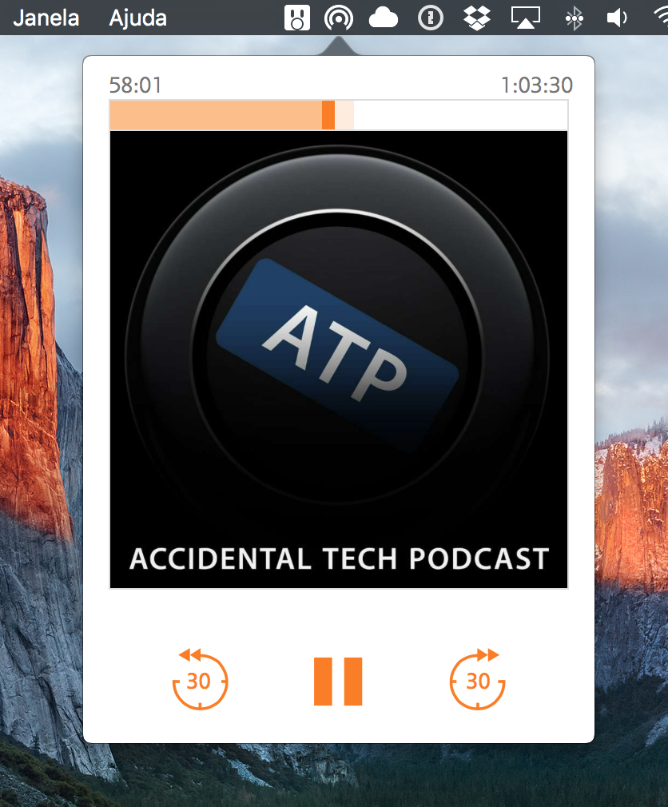

Psst, want me to love you? Then [check this out](https://getbrowserhub.com) 😁

# PodcastMenu

PodcastMenu is a simple app which puts [Overcast](https://overcast.fm) on your Mac's menu bar so you can listen to your favorite podcasts while you work.

# Easy Playback Controls
While the app is playing a podcast, you can use your keyboard's media keys to control playback:

* Play/pause to play or pause the currently playing episode
* Forward/backward to advance/go back 30 seconds

# Download

[⬇️ Click here to download the latest release](https://github.com/insidegui/PodcastMenu/raw/master/Releases/PodcastMenu_v1.2.zip).

## Disclaimer

This is not an "official" app, I'm not affiliated with Overcast, I just love It and really wanted it to have a Mac app 😁

OBS: This app is free and open source but It's license prohibits anyone from distributing It (free or paid) on any AppStore.

# Get Overcast

If you love podcasts and you're not using Overcast, you definitely should. 

[Overcast is available on the App Store](https://itunes.apple.com/app/overcast-podcast-player/id888422857).
